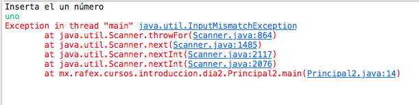
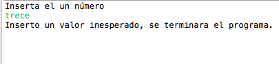

# Fundamentos de programacion con Java
1. [Prólogo](#prologo)
2. [Introducción](#introduccion)
    1. [Historia](#historia)
    2. [Aplicaciones/Uso de Java](#aplicaciones)

# <a name="prologo"></a>Prólogo
Retomo en mi vida la parte de enseñar, sé lo complicado que es encontrar cursos en el idioma español y sobre todo que estén al alcance de uno (ya sea distancia, precio y tiempo).

Al lenguaje **Java** le tengo mucho cariño ya que me abrio muchas puertas laboralmente, fue la primera certificación que obtuve en mi vida y ha sido la que me dió pie a querer saber más de diferentes cosas.

Espero que con esto pueda ayudar a más personas a aprender y sobre todo poder transmitirles mi sed de conocimiento.

---

# <a name="introduccion"></a>Introducción
Hoy en día existen diversos lenguajes de programación que es difícil decidir por "uno" (sugiero aprender varios), si vemos diversas estadisticas en sitios como [TIOBE](https://www.tiobe.com/tiobe-index/), o [StackOverFlow](https://insights.stackoverflow.com/survey/2019) veremos que *Java* se mantiene constante en el *top ten*.

¿Es entonces *Java*, una buena opción?, a titulo personal sí. Sin embargo el reto es utilizar el lenguaje para hacer lo que deseamos de *la mejor manera posible, "rápido", eficaz y confiable*. Y para llegar a ese objetivo debemos estar en constante capacitación, entender las limitantes y las ventajas del lenguaje.

Así que para iniciar este viaje en el mundo de *Java* un poco de historia...

## <a name="historia"></a>Historia

*Java* fue creado por **Sun Microsystem** en 1991, pero no con el nombre de *Java*, sino con **Oak** porqué era un roble que se encontraba afuera de la oficina de James Gosling lider del equipo *Green Team*. Después el lenguaje se llamo *Green* y finalmente se nombro *Java* como el café *(un café originario de Asia)*, por eso el logotipo hace uso de una taza.


> Sin embargo hay teorias que el nombre viene de: **J**ames Gosling, **A**rthur **V**an Hoff, y **A**ndy Bechtolsheim. Otros abogan por el siguiente acrónimo, **J**ust **A**nother **V**ague **A**cronym ("sólo otro acrónimo ambiguo más"). La hipótesis que más fuerza tiene es la de que Java debe su nombre a un tipo de café disponible en la cafetería cercana

Su sintaxis deriva en gran parte de **C/C++** porqué era los lenguajes de mayor fuerza en su fecha. Pero no fue hasta 1995 que tomo fuerza para convertirse en el *Java* que conocemos ahora, las fechas de sus versiones sería así:

- JDK 1.0 *Enero 1996*
- JDK 1.1 *Febrero 1997*
- J2SE 1.2 *Diciembre 1998*
- J2SE 1.3 *Mayo 2000*
- J2SE 1.4 *Febrero 2002*
- J2SE 1.5 *Septiembre 2004*
- Java SE 6 *Diciembre 2006*
- Java SE 7 *Julio 2011*
- Java SE 8 *Marzo 2014*
- Java SE 9 *Julio 2017*
- Java SE 10 *Marzo 2018*
- Java SE 11 *Septiembre 2018*
- Java SE 12 *Marzo 2019*

Una de los hitos de *Java* fue cuando *Sun Microsystem* hizo licenciar la mayoría de sus tecnologías *Java* bajo la *Licencia Pública General (GNU General Public License)* en 2007, dando origen a OpenJDK en 2008.

Dentro de la historia de este lenguaje sucede la compra definitiva de *Sun Microsystem* por parte de **Oracle**, modificando parte del ecosistema *Java* en lo que respecta al licenciamiento y a la fecha de lanzamiento de versiones mayores (cada seis meses).

Ahora uno de los grandes miedos o mitos es "si es gratis o no *Java*". En la actualidad puedes seguir desarrollando usando el *Oracle OpenJDK* sin pagar nada a *Oracle*, el cobró es entornos productivos o usuarios finales de las aplicaciones realizadas, osea las que usan el *JRE de Oracle*. Pero como se menciono arriba cuando *Sun Microsystem* hizo la *"liberación"* de *Java* permitio que existieran alternativas realizadas por *IBM, RedHat, la comunidad de Linux, Microsoft, Amazon, etc...*

Así que uno puede seguir programando y ejecutando código *Java* sin pagar un solo dolar a *Oracle*, hay proyectos *Open Source* que tienen la fuerza para sostener la mantenibilidad de versiones de *Java* para dar *Soporte de Largo Plazo (LTS Long Term Support)*, pero si nuestro negocio/empresa requiere de un soporte de terceros para levantar incidentes (tickets) existen alternativas a *Oracle* como *Zulu Enterprise* de Microsoft.

Aquí un listado de alternativas *Open Java Development Kit (OpenJDK)*:

- [Amazon Corretto](https://aws.amazon.com/es/corretto/)
- [Zulu](https://www.azul.com/downloads/zulu/)
- [AdoptOpenJDK](https://adoptopenjdk.net/)
- [OpenJDK de los distros **Linux**](https://openjdk.java.net/install/)

## <a name="aplicaciones"></a>Aplicaciones/Uso de Java

- Aplicaciones de Android
- Aplicaciones de Web
- Aplicaciones de Software
- Aplicaciones de Big Data

---

# <a name="excepciones"></a>Excepciones y Errores

Al programar debemos considerar diferentes escenarios y uno de ellos es que puede fallar, así es, nuestro programa debe estar preparado para cometer fallos en tiempo de ejecución. A veces muchos de estos fallos se podrían mitigar creando una extensa interfaz que delimite los posibles valores a introducir, sin embargo eso no siempre funciona.

Y para ello debemos hacer una gestión de los posibles fallos que puedan ocurrir, como valores inesperados, desconexión, sobre carga, etc... esto con la finalidad de controlar el error y poder ejecutar otra seríe de pasos para llevar el control del flujo del programa para que haga lo que deseamos cuando suceda el fallo.

Ahora bien en *Java* existen dos tipos de fallos:
- **Errores**: Estos son fallos graves e involucran a la *JVM*, estos fallos detienen la ejecución del programa abruptamente y no pueden ser controlados, sino que deben ser corregidos.
- **Excepciones**: Estos fallos no son críticos y pueden ser tratados para poder continuar con la ejecución del programa. Las excepciones en se dividen en dos tipos:
    - Marcadas o verificadas *(checked)*
    - No marcadas o no verificadas *(unchecked)*

## Excepciones marcadas o verificadas *(checked)*

Las excepciones marcadas o verficadas son aquellas que heredan de *Exception* por lo que es obligatorio su captura. Las excepciones marcadas se definen usando la palabra reservada *throws*.

Un ejemplo de una excepción marcada en un método sería así:
```java
/**
 * Attempts to establish a connection to the given database URL.
 * The <code>DriverManager</code> attempts to select an appropriate driver from
 * the set of registered JDBC drivers.
 *
 * @param url a database url of the form
 *  <code> jdbc:<em>subprotocol</em>:<em>subname</em></code>
 * @return a connection to the URL
 * @exception SQLException if a database access error occurs or the url is
 * {@code null}
 * @throws SQLTimeoutException  when the driver has determined that the
 * timeout value specified by the {@code setLoginTimeout} method
 * has been exceeded and has at least tried to cancel the
 * current database connection attempt
 */
@CallerSensitive
public static Connection getConnection(String url)
    throws SQLException {

    java.util.Properties info = new java.util.Properties();
    return (getConnection(url, info, Reflection.getCallerClass()));
}
```

Así que cuando utilicemos el método *Connection* debemos usar el bloque *try-catch-finally (que son palabras reservadas)* que se define de la siguiente manera:

```java
try {
    /*
    *
    * Instrucciones que ejecutaremos antes de que suceda la excepción
    *
    */
} catch (<AQUI_VA_LA_EXCEPCION_A_ATRAPAR> variableDondeSeAlmacenaraLaExcepcion){
    /*
    *
    * Instrucciones que ejecutaremos cuando sucede la excepción atrapada
    *
    */
} finally {
    /*
    *
    * Instrucciones que se ejecutan haya sucedido la excepción o no
    *
    */
}
```

## Excepciones no marcadas o no verificadas *(unchecked)*

Las excepciones no marcadas o no verficadas son aquellas que heredan de *RuntimeException*, aun qué *RuntimeException* herede de *Exception* no es una excepción marcada o verficada, es la única excepción a la regla. Así que estas excepciones no exige el compilador que escribamos el bloque *try-catch-finally*, pero eso no quiere decir que no lo podamos usar.

Por ejemplo, si creamos un programa que recibe por teclado en la consola un número y el usuario inserta un caracter esto propiciara un error en tiempo de ejecución, en código sería así:

Este sería el programa que espera un número
```java
import java.util.Scanner;

public class Principal2 {

    public static void main(final String[] args) {

        Scanner entrada;

        int numero = 0;
        System.out.println("Inserta el un número");
        entrada = new Scanner(System.in);
        numero = entrada.nextInt();
        System.out.println("El número que inserto es: " + numero);

    }

}
```

Pero si el usuario inserta cualquier caracter esto lanzaria una excepción de este tipo:



Si se nota el código anterior compilo sin problema alguno, pero en *en tiempo de ejecución* fue cuando sucedio la excepción, así que para solucionar el problema sería así:

```java
import java.util.InputMismatchException;
import java.util.Scanner;

public class Principal2 {

    public static void main(final String[] args) {

        Scanner entrada;

        int numero = 0;
        System.out.println("Inserta el un número");
        try {
            entrada = new Scanner(System.in);
            numero = entrada.nextInt();
            System.out.println("El número que inserto es: " + numero);
        } catch (final InputMismatchException ex) {
            System.out.println("Inserto un valor inesperado, se terminara el programa.");
        }

    }

}
```

Ahora el programa termina bajo nuestros terminos y no inesperadamente.



Un mismo bloque de código puede lanzar diferentes excepciones *(no al mismo tiempo)* así que podemos atrapar varias excepciones, ejemplo:
```java
try {
    /*
    *
    * Instrucciones que ejecutaremos antes de que suceda la excepción
    *
    */
} catch (<AQUI_VA_LA_EXCEPCION_A_ATRAPAR> variableDondeSeAlmacenaraLaExcepcion){
    /*
    *
    * Instrucciones que ejecutaremos cuando sucede la excepción atrapada
    *
    */
} catch (<AQUI_VA_LA_EXCEPCION_A_ATRAPAR> variableDondeSeAlmacenaraLaExcepcion){
    /*
    *
    * Instrucciones que ejecutaremos cuando sucede la excepción atrapada
    *
    */
}catch (<AQUI_VA_LA_EXCEPCION_A_ATRAPAR> variableDondeSeAlmacenaraLaExcepcion){
    /*
    *
    * Instrucciones que ejecutaremos cuando sucede la excepción atrapada
    *
    */
}finally {
    /*
    *
    * Instrucciones que se ejecutan haya sucedido la excepción o no
    *
    */
}
```

Pero apartir de *Java SE 7* existe el multicatch que es así:

```java
try {
    /*
    *
    * Instrucciones que ejecutaremos antes de que suceda la excepción
    *
    */
} catch (<AQUI_VA_LA_EXCEPCION_A_ATRAPAR>|<AQUI_VA_LA_EXCEPCION_A_ATRAPAR> variableDondeSeAlmacenaraLaExcepcion){
    /*
    *
    * Instrucciones que ejecutaremos cuando sucede la excepción atrapada
    *
    */
} finally {
    /*
    *
    * Instrucciones que se ejecutan haya sucedido la excepción o no
    *
    */
}
```

Usando el multicatch en el código anterior sería así:
```java
import java.util.InputMismatchException;
import java.util.Scanner;

public class Principal2 {

    public static void main(final String[] args) {

        Scanner entrada;

        int numero = 0;
        System.out.println("Inserta el un número");
        try {
            entrada = new Scanner(System.in);
            numero = entrada.nextInt();
            System.out.println("El número que inserto es: " + numero);
        } catch (final IllegalStateException | InputMismatchException ex) {
            System.out.println("Inserto un valor inesperado, se terminara el programa.");
        }

    }

}
```
